# LinkSprite weather station
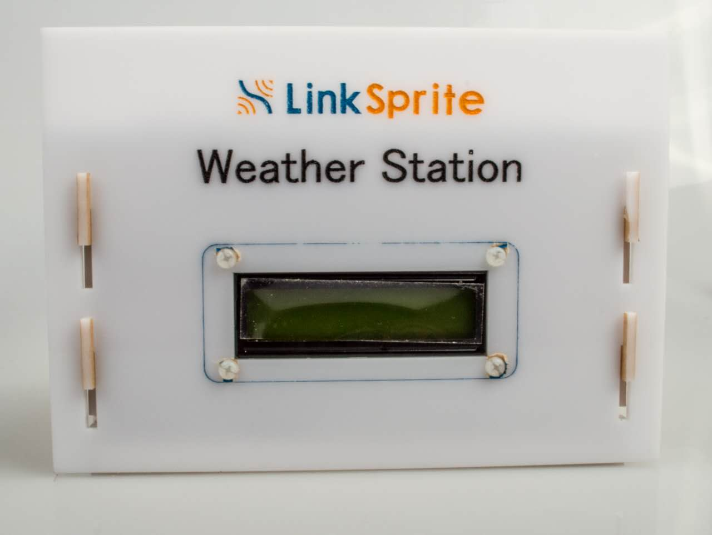
LinkSprite weather station is one kind of LinkSprite IoT kit which is powered by ESP8266 WiFi SoC. This kit can automatically collect environmental data including temperature, humidity and pressure, and display them on the local LCD. At the same time, it would upload these data periodically to LinkSprite IoT cloud server. User can check them on the website or using APP. This also is an open source product and you can download the hardware and software from the website

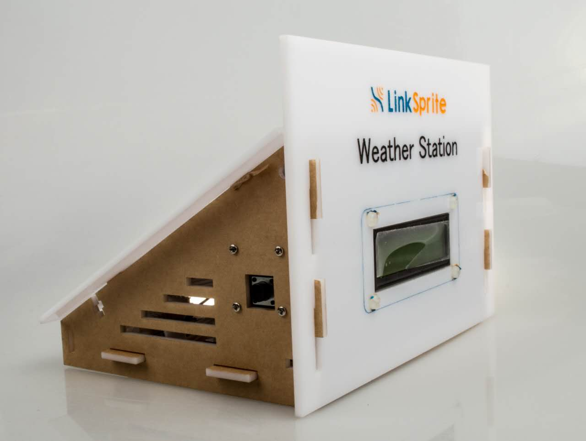
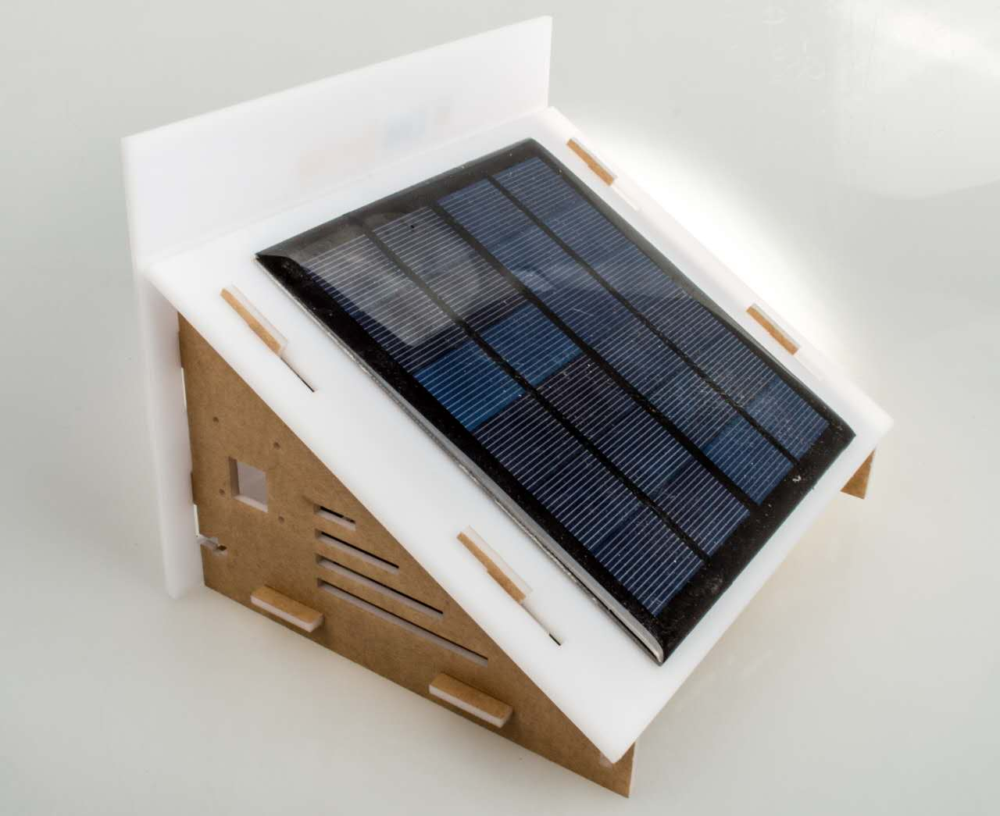

## Features
* LinkNode D1
* Temperature & humidity sensor
* Pressure sensor
* RTC module
* 16x2 SerLCD
* Solar powered
* Automatically sync data to LinkSpriteIO

## Tutorial
### 1. Hardware assembling
* There are 6 acrylic panels to build a case for weather station

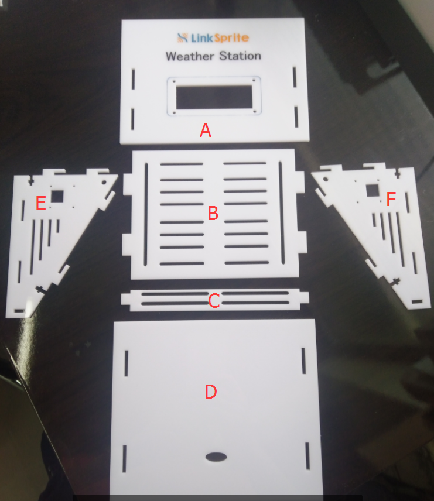

* Mount the solar panel onto the D panel, connect solar panel and battery to power management module

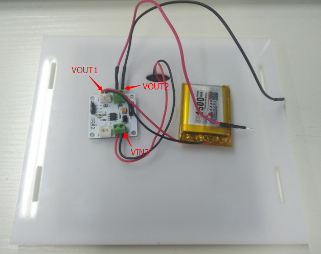
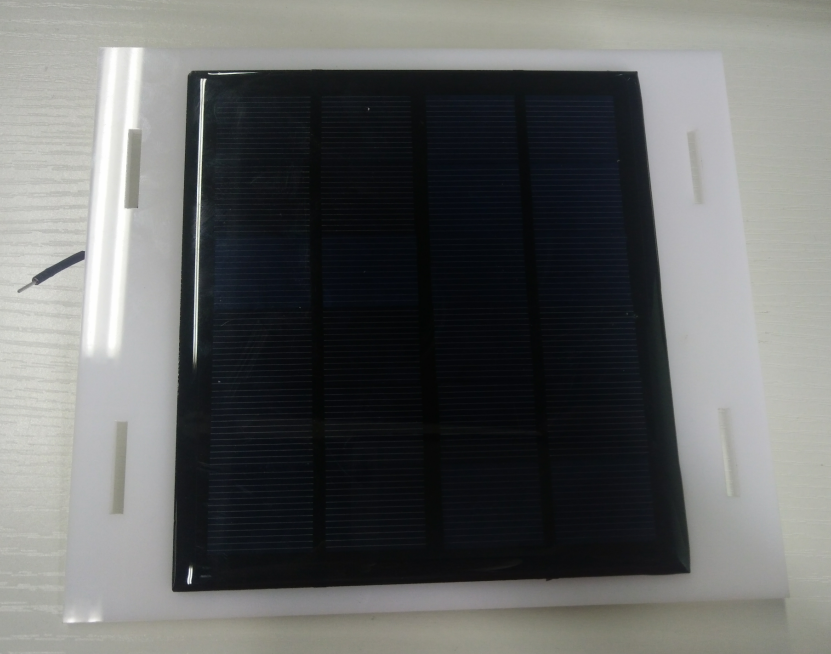

* Use screws to mount the LinkNode D1 and T&M sensor module onto the B panel
* Use Blue-tack to paste the pressure sensor module and RTC module on B panel

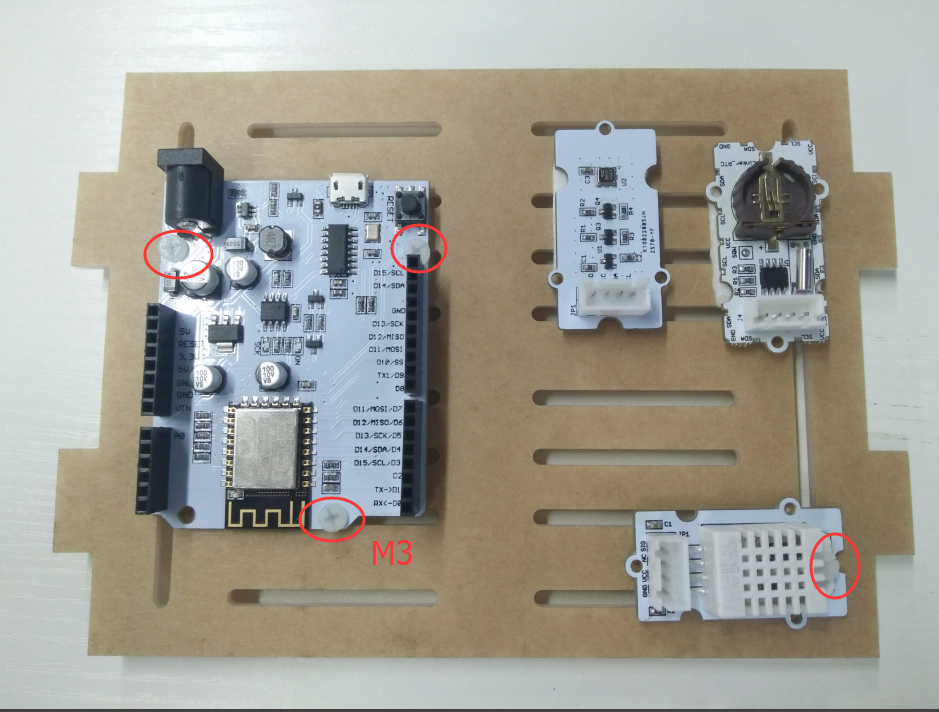

* Mount the SerLCD on the A panel

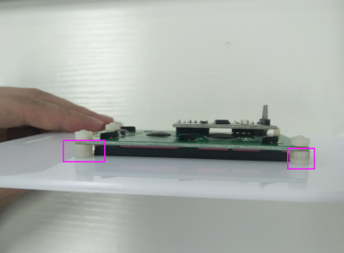
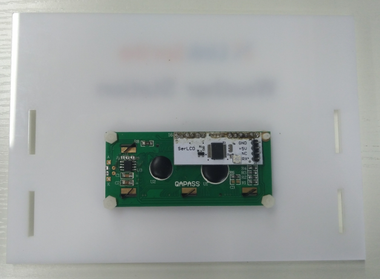
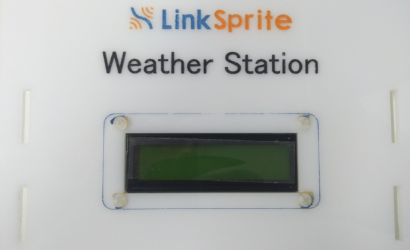

* Mount the button module on the E or F panel

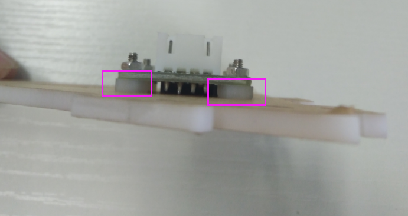
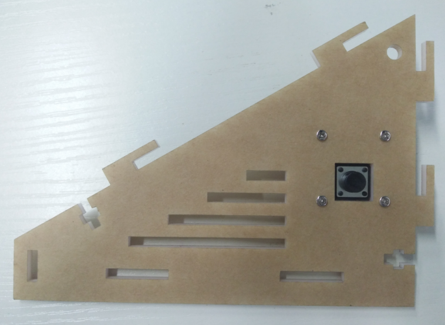

* According to the following connection diagram to connect the LinkNode D1 and other peripherals

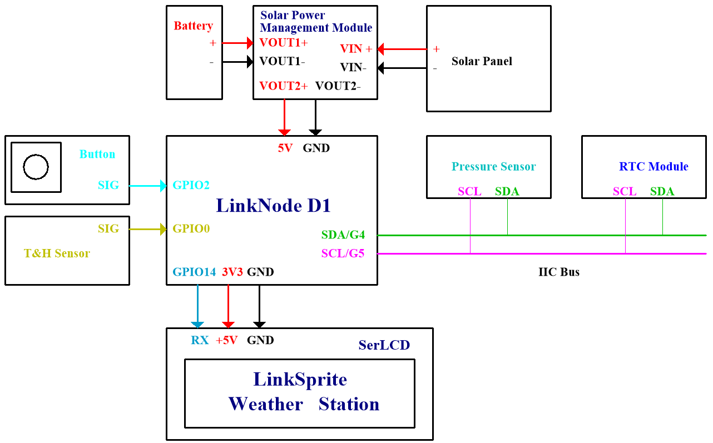
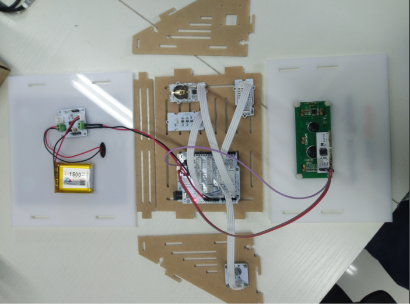

### 2. Access to LinkSpriteIO
a. Register to or sign in **www.linksprite.io**
* - Go to **My devices --> Create DIY device**

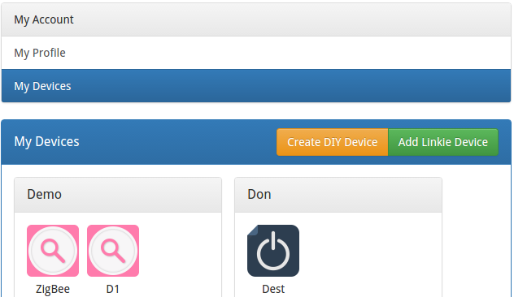

* Create a new device:
    * Device Name: any name
    * Device Type: **03(Weather station)**
    * Group Name : any name

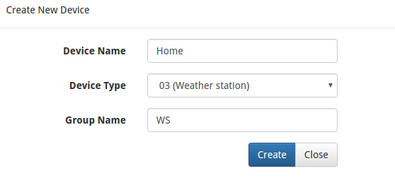

- Open the new created Device and get **Device ID**

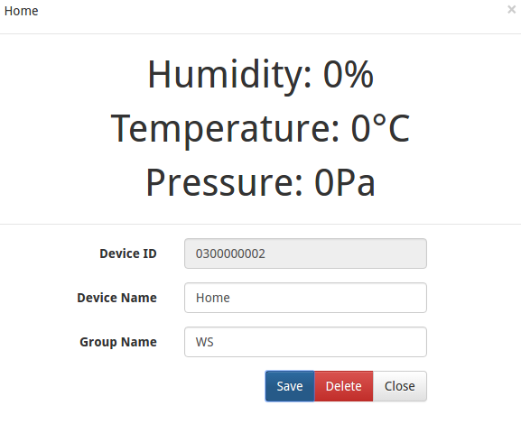

- Go to **My profile** to get your own API key

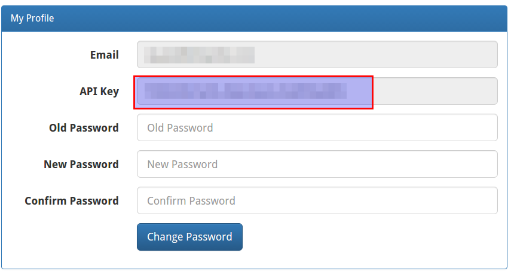

### 3. Software programming
#### a. Install Arduino IDE
* Make sure you have installed Arduino IDE with ESP8266 Arduino core, details you can check [here](http://www.linksprite.com/wiki/index.php5?title=LinkNode_D1)

#### b. Prepare the libraries
* Download the Arduino project and related libraries from [github](https://github.com/YaoQ/weather-station)
* Unzip the **WeatherStationLibraries.zip** and move the files to the Arduino/libraries which is located in your account directory
* Open Arduino IDE and go to **Sketch --> Include Library --> Manage Libraries**
* Search the **wifimanager** and install it

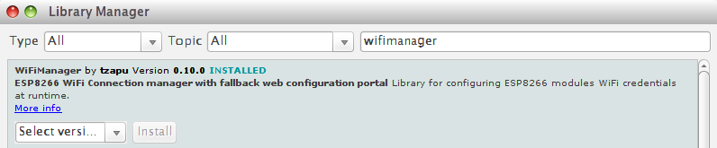

#### c. Update and your program

* Using Arduino IDE to open the **WeatherStation** Arduino project
* Update Arduino project with your own deviceID and apikey

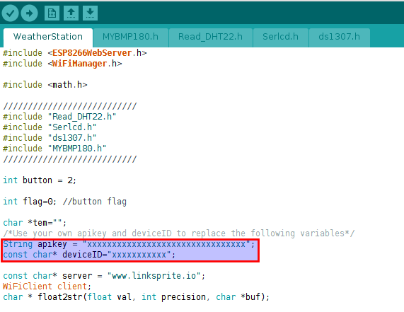 
 
#### d. Download the program

* Configure the board type and select the serial port which is recognized by your PC when using usb cable to connect PC and linkNode D1
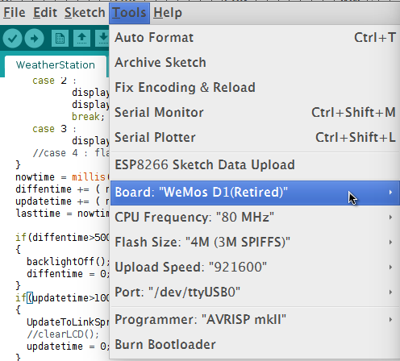

* Click the run button to program LinkNode D1

### 4. Run and test
* After upload the program, the LinkNode D1 will create a AP called **LinkNodeAP**
* Use your mobile phone to connect this AP
* Open a browser and enter the IP address **10.0.1.1** and you will see the following website:

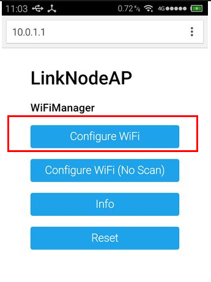

* Click the button **configure WiFi**
* Select your WiFi AP which you want to connect and enter your WiFi password
* If connecting failed, you can go to the same website to configure it again

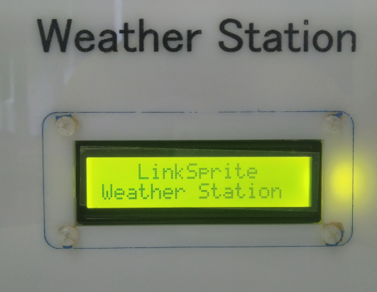

* Short press the button on the weather station and it will turn on the backlight of LCD
* Long press the button and it will change the display information

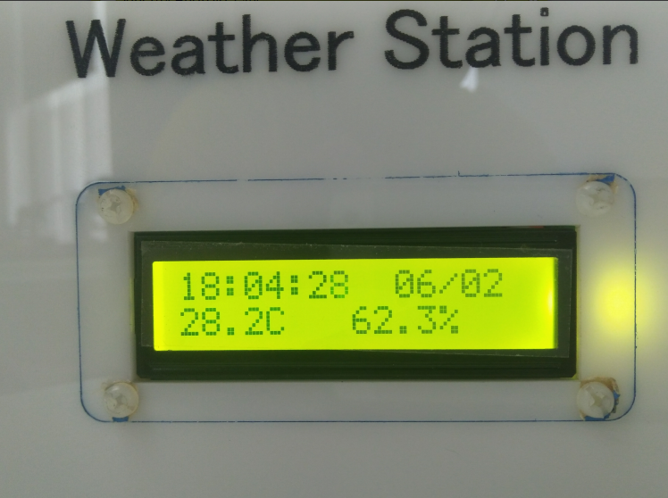
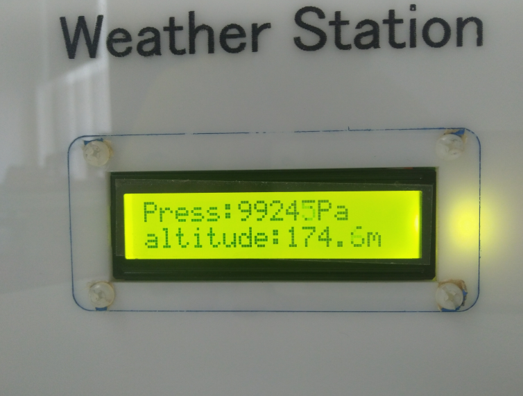

* Go to the device webpage on LinkSprite.io and check the data which are sent from LinkNode D1.

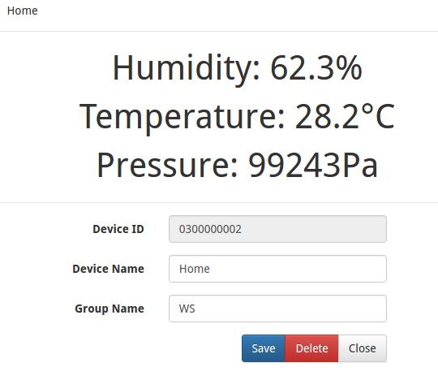

### 5. Use APP to access Weather station
We has developed an Android APP especially for Weather station. We can use it to check the environment data sent from Weather station. The following section will introduce how to use this APP.

#### a. Install Android APP

- Download the APK file from the [github](https://github.com/YaoQ/weather-station/tree/master/APP) and install it.

#### b. Login LinkSpriteIO

- Please enter your Email and your password, then click the **SIGN IN** button

  

#### c.Go to device list

- This page will show the weather station device that you created before.
- Just click this device to check the current data.

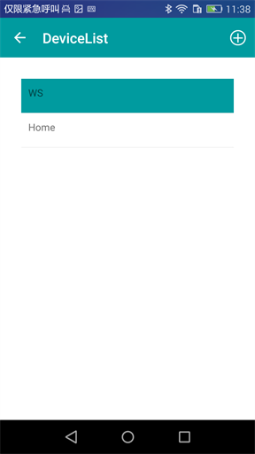

#### d. Show the current data

- Click each data on the page, then it will show historical data.

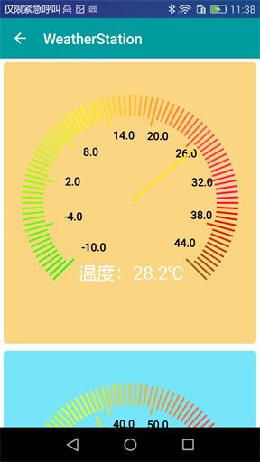 
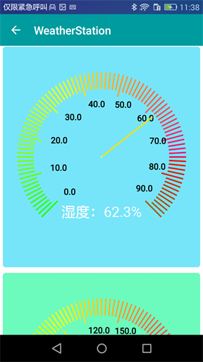 
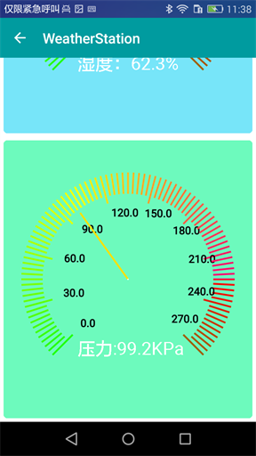

#### e. Show the historical data

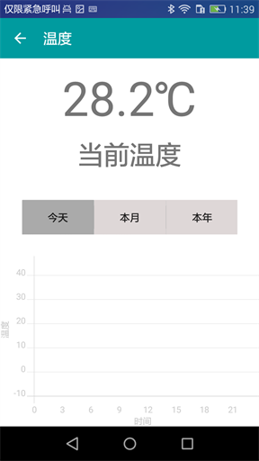

## Reference
1. [github repository of weather station](https://github.com/YaoQ/weather-station)

